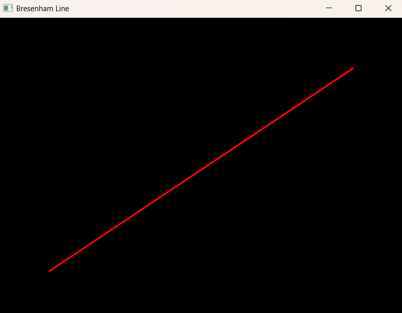

# Computer Graphics using OpenGL (Python)

This repository contains implementations of fundamental Computer Graphics algorithms using Python and OpenGL.

---

## Algorithms Implemented

### 1. Bresenham Line Drawing Algorithm

The Bresenham Line Drawing Algorithm is used to generate a straight line on a raster display using efficient integer arithmetic.

#### Output



#### Run

```bash
python bresenham_line/bresenham_line.py