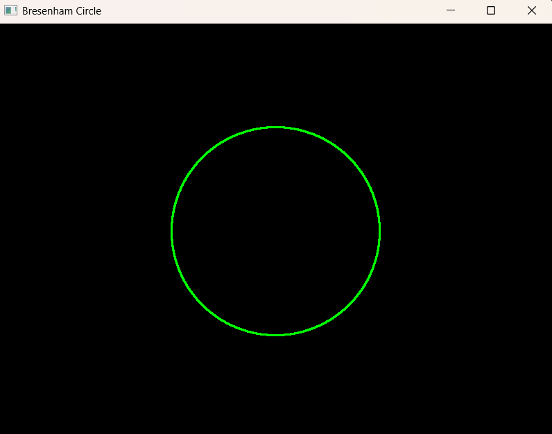
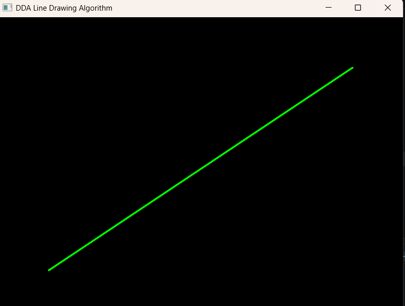
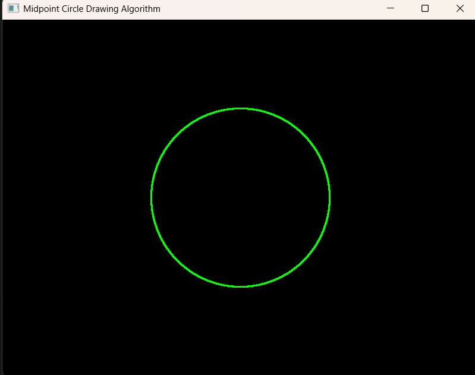
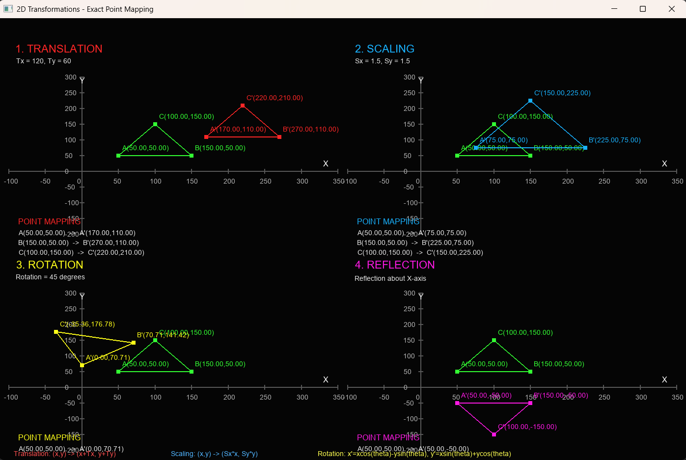

# Computer Graphics using OpenGL (Python)

This repository contains implementations of fundamental Computer Graphics algorithms using Python and OpenGL.

---

## 1. Bresenham Line Drawing Algorithm

### Output


### Run

```bash
python bresenham_line/bresenham_line.py
```

---

## 2. Bresenham Circle Drawing Algorithm

### Output



### Run

```bash
python bresenham_circle/bresenham_circle.py
```

---

## 3. DDA Line Drawing Algorithm

### Output



### Run

```bash
python dda_line/dda_line.py
```

---

## 4. Midpoint Circle Drawing Algorithm

### Output



### Run

```bash
python midpoint_circle/midpoint_circle.py
```

---

## 5. 2D Transformations

### Output



### Run

```bash
python transformations/transformations.py
```

---

## Requirements

Install the required packages using:

```bash
pip install -r requirements.txt
```

### Libraries Used

- Python
- PyOpenGL
- PyOpenGL-accelerate
- GLFW
- NumPy
- Pillow

---

## Project Structure

```text
openGL/
│
├── bresenham_line/
│   ├── bresenham_line.py
│   └── bresenham_line.png
│
├── bresenham_circle/
│   ├── bresenham_circle.py
│   └── bresenham_circle.png
│
├── dda_line/
│   ├── dda_line.py
│   └── dda_line.png
│
├── midpoint_circle/
│   ├── midpoint_circle.py
│   └── midpoint_circle.png
│
├── transformations/
│   ├── transformations.py
│   └── transformations.png
│
├── main.py
├── README.md
├── requirements.txt
└── start.bat
```

---

## Algorithms

| No. | Algorithm | Category |
|---|---|---|
| 1 | Bresenham Line | Line Drawing |
| 2 | Bresenham Circle | Circle Drawing |
| 3 | DDA | Line Drawing |
| 4 | Midpoint Circle | Circle Drawing |
| 5 | 2D Transformations (Translation, Scaling, Rotation, Reflection) | Transformation |

---

## Technologies

- Python
- OpenGL
- PyOpenGL
- GLFW
- NumPy
- Pillow
- Git
- GitHub

---

## Author

**Mohith R**

Computer Science Engineering 
RV University